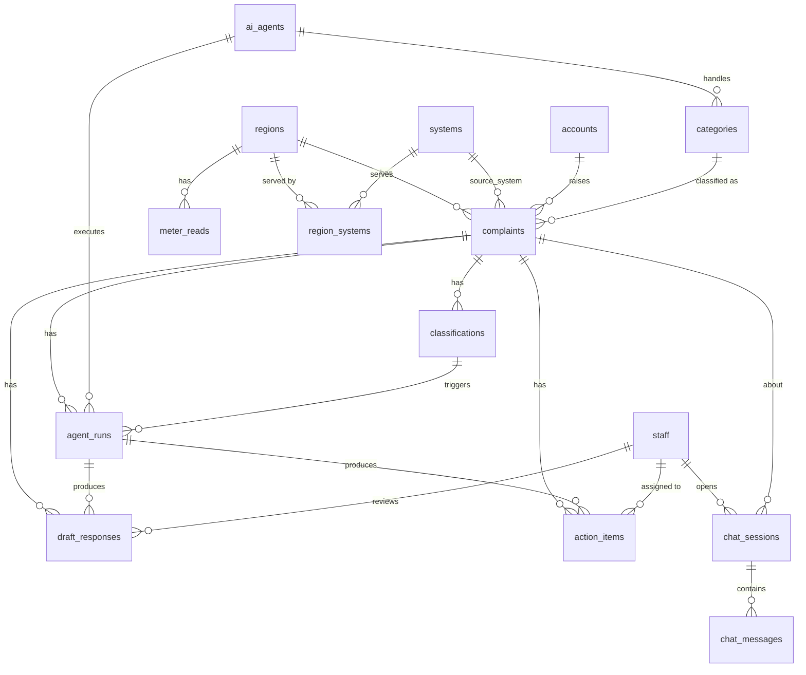

# Database Schema (proposal)

Postgres on Tiger Data. See [requirements.md](requirements.md) for what each part is used for.
At about 25k complaints no partitioning or hypertables are needed.

## 1. Overview

**Loaded from the CSVs** (all columns kept): `systems`, `complaints`, `meter_reads`, `contact_centre_staffing`, `monthly_kpis`, `ai_pilot_2025`, `unit_costs`.
**Supporting reference tables:** `regions`, `region_systems`, `accounts`, `categories`, `ai_agents`, `app_settings`.
**New workflow tables:** `staff`, `classifications`, `agent_runs`, `draft_responses`, `action_items`, `sim_scenarios`, and (optional) `chat_sessions`, `chat_messages`.
**Views:** the dashboards read from SQL views (section 4).

## 2. Relationships



`monthly_kpis`, `ai_pilot_2025`, `unit_costs` and `sim_scenarios` stand alone (the simulator reads the first and third).

## 3. Tables

### 3.1 Reference data (from the CSVs)

```sql
CREATE TABLE systems (
    system_id          TEXT PRIMARY KEY,           -- SYS-01 .. SYS-15
    system_name        TEXT NOT NULL,
    purpose            TEXT,
    year_installed     INT,
    vendor             TEXT,
    tech_stack         TEXT,
    records_held       BIGINT,
    integration_method TEXT,                        -- nightly batch, REST API, streaming ...
    annual_run_cost    NUMERIC(14,2),
    owning_function    TEXT,
    notes              TEXT
);

CREATE TABLE regions (
    region TEXT PRIMARY KEY                          -- Ashford, Barrowdale, Calderfield, Dunmoor, Eastmarch, Fenwick
);

-- Parsed from meter_reads.systems_serving_region ("SYS-01/SYS-06")
CREATE TABLE region_systems (
    region    TEXT REFERENCES regions(region),
    system_id TEXT REFERENCES systems(system_id),
    PRIMARY KEY (region, system_id)
);

-- Account id only: 284 accounts appear in more than one region, so region lives on the complaint.
CREATE TABLE accounts (
    account_id TEXT PRIMARY KEY
);

CREATE TABLE ai_agents (                            -- one row per domain agent
    agent_id       TEXT PRIMARY KEY,                -- billing, metering, field_services, customer_support, general
    name           TEXT NOT NULL,
    instructions   TEXT,                            -- system prompt / config version reference
    active         BOOLEAN NOT NULL DEFAULT TRUE
);

CREATE TABLE categories (                           -- maps complaint category to a domain agent
    category TEXT PRIMARY KEY,
    agent_id TEXT NOT NULL REFERENCES ai_agents(agent_id)
);

CREATE TABLE complaints (
    complaint_id                   TEXT PRIMARY KEY,   -- NW-100001
    account_id                     TEXT NOT NULL REFERENCES accounts(account_id),
    date_opened                    DATE NOT NULL,
    date_closed                    DATE,
    status                         TEXT NOT NULL CHECK (status IN ('Open','Closed','Closed - reopened')),
    channel                        TEXT NOT NULL CHECK (channel IN ('Phone','Web form','Email','Social','Post','Regulator referral')),
    category                       TEXT NOT NULL REFERENCES categories(category),
    priority                       TEXT NOT NULL CHECK (priority IN ('P1','P2','P3')),
    region                         TEXT NOT NULL REFERENCES regions(region),
    source_system                  TEXT NOT NULL REFERENCES systems(system_id),
    transferred_between_systems    BOOLEAN NOT NULL,
    sla_days                       INT NOT NULL,       -- 5 / 10 / 20
    days_to_close                  INT,                -- NULL while open
    sla_breach                     BOOLEAN NOT NULL,   -- source flag; unreliable on open cases, use v_case_sla
    reopened                       BOOLEAN NOT NULL,
    resolution_action              TEXT,               -- NULL while open
    resolvable_by_information_only BOOLEAN,            -- NULL while open
    bill_correction_value          NUMERIC(10,2)       -- NULL when no correction
);
CREATE INDEX ON complaints (status);
CREATE INDEX ON complaints (account_id);
CREATE INDEX ON complaints (region, category);
CREATE INDEX ON complaints (date_opened);

CREATE TABLE meter_reads (
    month                    TEXT NOT NULL,            -- 'YYYY-MM'
    region                   TEXT NOT NULL REFERENCES regions(region),
    accounts                 INT NOT NULL,
    estimated_read_rate      NUMERIC(4,3) NOT NULL,    -- share of bills based on an estimate
    smart_meter_penetration  NUMERIC(4,3) NOT NULL,
    billing_exceptions_raised INT NOT NULL,
    systems_serving_region   TEXT,                     -- raw CSV value
    PRIMARY KEY (month, region)
);

CREATE TABLE monthly_kpis (
    month                             TEXT PRIMARY KEY,
    complaints_opened                 INT,
    complaints_closed                 INT,
    avg_days_to_close                 NUMERIC(5,1),
    first_contact_resolution_rate     NUMERIC(4,3),
    inbound_calls                     INT,
    cost_to_serve_per_account         NUMERIC(6,2),
    regulator_satisfaction_score_of_5 NUMERIC(3,2)
);

CREATE TABLE ai_pilot_2025 (                          -- loaded for reference, no screen built
    month                              TEXT PRIMARY KEY,
    assistant_sessions                 INT,
    fully_contained_rate               NUMERIC(4,3),
    escalated_to_agent_rate            NUMERIC(4,3),
    abandoned_rate                     NUMERIC(4,3),
    repeat_contact_within_7_days_rate  NUMERIC(4,3),
    assistant_csat_of_5                NUMERIC(3,2),
    complaint_raised_after_session_rate NUMERIC(4,3)
);

-- One row per CSV row (11 rows in the second data pack, including the hiring cost).
-- cost_key is a stable handle the simulator queries, so it never depends on the wording of `item`.
CREATE TABLE unit_costs (
    cost_key    TEXT PRIMARY KEY,
    item        TEXT NOT NULL UNIQUE,                 -- text from the CSV
    unit_cost   NUMERIC(12,2) NOT NULL,
    unit        TEXT,
    source_note TEXT
);
-- cost_key values:
--   call                    Inbound call handled by agent                  7.40 per call
--   complaint_standard      Complaint handled end to end (average)        68.00
--   complaint_transferred   Complaint ... (transferred between systems)  121.00
--   bill_correction         Manual bill correction and re-issue           34.00
--   field_visit             Field meter visit                             92.00
--   smart_meter_install     Smart meter installation                     148.00
--   staff_annual            Contact centre agent, fully loaded         46000.00 per FTE per year
--   staff_hire              Recruiting and onboarding a contact centre agent  11500.00 per hire
--   ai_pilot_annual         AskNorthwind assistant pilot              640000.00 per year
--   penalty_quarter         Regulator penalty, enhanced monitoring   2400000.00 per quarter in breach
--   compensation            Compensation payment                          40.00 per case
-- The CSV's "contact centre agent" rows mean human staff. In this system "agent" is reserved for AI agents.

-- Live calculations use this date, not now(): the data runs to 2026-09-30.
CREATE TABLE app_settings (
    key   TEXT PRIMARY KEY,                           -- e.g. 'as_of_date'
    value TEXT NOT NULL
);
```

### 3.2 Workflow tables (new)

```sql
CREATE TABLE staff (
    staff_id SERIAL PRIMARY KEY,
    name     TEXT NOT NULL,
    role     TEXT NOT NULL CHECK (role IN ('contact_centre','team_lead','manager')),
    team     TEXT                                     -- e.g. billing, metering, field
);

-- Output of the Laya classification layer (implemented in app/models.py).
-- History is kept; one row per complaint is current. complaint_id is not yet a foreign key
-- because the complaints table is not loaded by the app yet.
CREATE TABLE classifications (
    id                     BIGSERIAL PRIMARY KEY,
    complaint_id           TEXT NOT NULL,
    classifier_version     TEXT NOT NULL,
    is_current             BOOLEAN NOT NULL DEFAULT TRUE,
    created_at             TIMESTAMPTZ NOT NULL DEFAULT now(),
    as_of_date             DATE NOT NULL,             -- days open are measured to this date
    input                  JSON NOT NULL,             -- the complaint as submitted
    emergency              BOOLEAN NOT NULL,
    emergency_probability  REAL,
    group_name             TEXT,                      -- Billing, Metering, Field services, Customer support, General
    group_confidence       REAL,                      -- Laya's top probability
    group_source           TEXT,                      -- laya, or data on a low-confidence fallback
    laya_group             TEXT,                      -- Laya's own pick, kept for comparison
    subcategory            TEXT,                      -- a Northwind data category
    subcategory_confidence REAL,
    subcategory_source     TEXT,                      -- laya or data
    low_confidence         BOOLEAN NOT NULL DEFAULT FALSE,  -- Laya's top probability was under the threshold
    group_matches_data     BOOLEAN,                   -- Laya's group vs the data category; NULL if the data has none
    subcategory_matches_data BOOLEAN,
    priority               TEXT NOT NULL,             -- P1..P3 after flags
    base_priority          TEXT NOT NULL,             -- before flags
    base_priority_source   TEXT NOT NULL,             -- data, laya or emergency
    urgency_score          REAL,
    routed_team            TEXT NOT NULL,
    lane                   TEXT NOT NULL,             -- emergency, review, quick_lane, standard
    likely_cause           TEXT,                      -- estimated_reading
    flags                  JSON NOT NULL,             -- flags that fired, with reasons
    laya_output            JSON NOT NULL              -- raw Laya answers, for audit
);
CREATE INDEX ON classifications (complaint_id);
CREATE UNIQUE INDEX one_current_classification
    ON classifications (complaint_id) WHERE is_current;

-- Audit of each AI agent run
CREATE TABLE agent_runs (
    run_id            BIGSERIAL PRIMARY KEY,
    complaint_id      TEXT NOT NULL REFERENCES complaints(complaint_id),
    agent_id          TEXT NOT NULL REFERENCES ai_agents(agent_id),
    classification_id BIGINT REFERENCES classifications(id),
    status            TEXT NOT NULL CHECK (status IN ('running','succeeded','failed')),
    model             TEXT,
    context           JSONB,                          -- profile, account history, meter data given to the agent
    error             TEXT,
    started_at        TIMESTAMPTZ NOT NULL DEFAULT now(),
    finished_at       TIMESTAMPTZ
);
CREATE INDEX ON agent_runs (complaint_id);

CREATE TABLE draft_responses (
    draft_id     BIGSERIAL PRIMARY KEY,
    complaint_id TEXT NOT NULL REFERENCES complaints(complaint_id),
    run_id       BIGINT REFERENCES agent_runs(run_id),
    body         TEXT NOT NULL,                       -- as generated
    status       TEXT NOT NULL DEFAULT 'draft' CHECK (status IN ('draft','approved','edited','rejected','sent')),
    final_body   TEXT,                                -- text after staff edits
    reviewed_by  INT REFERENCES staff(staff_id),
    reviewed_at  TIMESTAMPTZ,
    created_at   TIMESTAMPTZ NOT NULL DEFAULT now()
);
CREATE INDEX ON draft_responses (complaint_id);

CREATE TABLE action_items (
    action_id    BIGSERIAL PRIMARY KEY,
    complaint_id TEXT NOT NULL REFERENCES complaints(complaint_id),
    run_id       BIGINT REFERENCES agent_runs(run_id),
    action_type  TEXT NOT NULL,                       -- correct_bill, book_meter_read, rebook_appointment, escalate_field, call_customer, send_reply ...
    description  TEXT NOT NULL,
    rationale    TEXT,                                -- why the agent suggests it
    rank         SMALLINT NOT NULL DEFAULT 1,         -- suggested order within the case
    status       TEXT NOT NULL DEFAULT 'open' CHECK (status IN ('open','in_progress','done','dismissed')),
    assigned_team TEXT,
    assigned_to  INT REFERENCES staff(staff_id),
    due_date     DATE,
    created_at   TIMESTAMPTZ NOT NULL DEFAULT now(),
    completed_at TIMESTAMPTZ
);
CREATE INDEX ON action_items (complaint_id);
CREATE INDEX ON action_items (status);

CREATE TABLE sim_scenarios (
    scenario_id SERIAL PRIMARY KEY,
    name        TEXT NOT NULL,                        -- base, conservative, target
    params      JSONB NOT NULL,                       -- transfer_reduction, fast_lane_share, fast_lane_days ...
    results     JSONB NOT NULL,                       -- avg_days, breach_rate, backlog, score, plus the cost block:
                                                      --   baseline_cost, transfer_saving, fast_lane_saving, total_saving,
                                                      --   fte_equivalent_freed, hires_needed, hiring_cost_year1,
                                                      --   system_running_cost, break_even_running_cost, penalty_avoided
    created_at  TIMESTAMPTZ NOT NULL DEFAULT now()
);

-- Optional (P2): staff chat assistant
CREATE TABLE chat_sessions (
    session_id   SERIAL PRIMARY KEY,
    staff_id     INT NOT NULL REFERENCES staff(staff_id),
    complaint_id TEXT REFERENCES complaints(complaint_id),   -- NULL for general questions
    created_at   TIMESTAMPTZ NOT NULL DEFAULT now()
);
CREATE TABLE chat_messages (
    message_id BIGSERIAL PRIMARY KEY,
    session_id INT NOT NULL REFERENCES chat_sessions(session_id),
    role       TEXT NOT NULL CHECK (role IN ('staff','assistant')),
    content    TEXT NOT NULL,
    created_at TIMESTAMPTZ NOT NULL DEFAULT now()
);
```

## 4. Views for the dashboards

| View | What it returns | Feeds |
|---|---|---|
| `v_case_sla` | Every complaint with its domain, days open (`days_to_close` if closed, else from `as_of_date`), days overdue against `sla_days`, live breach status (`days > sla_days`) and age band. Replaces the unreliable `sla_breach` on open cases. | Worklist, D1 |
| `v_case_profile` | For each category × region × source system, over closed cases: count, average days, information-only share, transfer rate, reopen rate, most common resolution. | Classification, agent context, C2 |
| `v_worklist` | Open cases joined with the current classification, draft status and open action items, ranked by breach risk and days overdue. | C1 |
| `v_backlog_flow` | Per month: opened, closed, net change, backlog at month end. | D1 |
| `v_backlog_breakdown` | Current open backlog counted by region, category, domain, priority, age band and breach status. | D1 |
| `v_region_meter_complaints` | Region × month: estimated-read rate, smart penetration, billing exceptions per 1,000 accounts, and billing and metering complaints per 1,000 accounts. | D2 |
| `v_account_history` | Every complaint per account with category, outcome, days and repeat counts. | C2, D4 |
| `v_agent_results` | Classes per domain, fast-lane volume, drafts by status (approved, edited, rejected). | D5 |
| `v_sim_baseline` | One row for the simulator's starting point: complaints opened in the last 12 months, transfer share, reopen share, monthly opened and closed (last 6 months), current backlog, average days by transferred and not transferred. | E2, E7, E8 |
| `v_unit_costs` | `unit_costs` as one row of named columns (`call`, `complaint_standard`, `staff_annual`, `staff_hire`, `penalty_quarter` and so on), so the simulator reads costs by name. | E7-E12 |
| `v_score_relationship` | Regression of `regulator_satisfaction_score_of_5` on `avg_days_to_close` from `monthly_kpis` (slope and intercept). | E4 |

The live definitions are in [../db/views.sql](../db/views.sql).

## 5. Load notes

The schema is applied to the Tiger Data service `htc-mock-test` (`rhw3xtuwno`, DEV). To rebuild on an empty database:

1. `db/schema.sql`: tables, indexes and fixed reference rows (`regions`, `ai_agents`, `categories`, `app_settings`).
2. `db/views.sql`: all views (`CREATE OR REPLACE`, safe to re-run).
3. `python3 db/build_seed.py`, then run `db/seed/*.sql` in name order (`ON CONFLICT DO NOTHING`, safe to re-run).

- `meter_reads`, `monthly_kpis`, `ai_pilot_2025` and `contact_centre_staffing` come from the main data pack. `unit_costs` comes from the second pack, because it adds the hiring cost. The second pack's meter, KPI and pilot files differ in every row. Swap the paths in `build_seed.py` if that pack turns out to be authoritative.
- Empty CSV cells for the open cases become NULL.
- `as_of_date` is `2026-09-30`.
- The app's `Base.metadata.create_all` in [../app/main.py](../app/main.py) only creates tables that have SQLAlchemy models, so it does not touch this schema.
